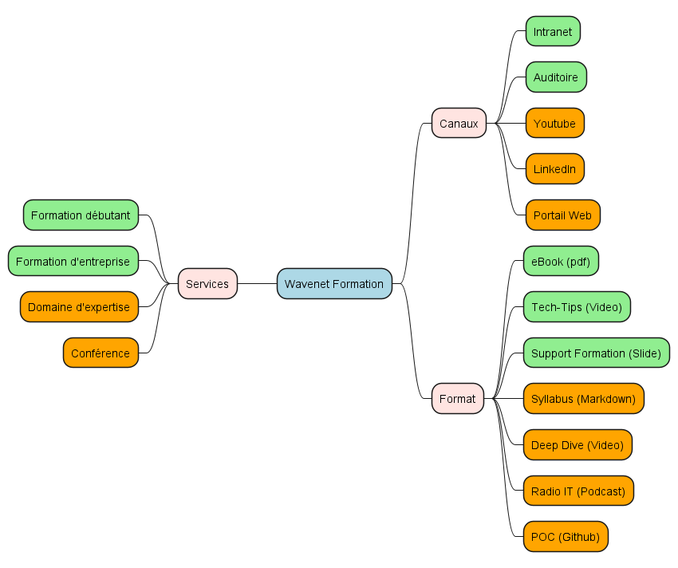

# Formation

## Services

Quels sont les services dans le cadre de la formation et à quel besoin répondent-ils ?

### Formation débutant

Répond aux besoins des centres de compétences, qui demandent des professionnelles de l'informatique pour donner des formations destinées à des profiles débutant complet ou néophyte de manière à inculquer les **bases de l'informatique et du développement** de manière à devenir autonome au sein d'une équipe et être en mesure de recevoir des tâches d'implémentation.

### Formation en entreprise

Sur base d'une demande ponctuelle d'un client, des collaborateurs Wavenet sont envoyés en entreprise pour des formations données directement a de _faux débutants_ nécessitant un **rafraichissement** des connaissances techniques, mais également organisationnelles lié aux **nouvelles pratiques et technologies**.

### Formation Expert

Dans le cadre de la veille technologique de profils medior et senior de manière à rester au top des **pratiques et technologies** pour suivre les tendances, mais également pour apporter des solutions **spécifiques** aux problématiques d'un client, des collaborateurs Wavenet offre leur expérience sous forme d'ateliers **ciblés**.

### Conférence

Dans le cadre de la veille technologique, d'une demande spécifique, ou dans le cadre d'une campagne marketing, faire connaitre **les grands principes** théoriques d'une ou plusieurs **méthodologies** et **technologies** sur base de cas d'utilisations.

## Canaux de diffusion

Quels sont les canaux de diffusion dans le cadre de la formation et à quel besoin répondent-ils ?

### Intranet

Concentrateur de formations tous formats confondus à destination des **collaborateurs Wavenet** de manière à pouvoir **suivre** ou **donner** une **formation**.

### Auditoire

Dispense une **formation** spécifique privilégiant les interactions directes avec un formateur **en présentiel**.

### YouTube

Concentrateur de **vidéos** formatives ou informatives de **type court**.

### LinkedIn Learning

Concentrateur de **vidéos** de formations de **type long**.

### Portail Web

Concentrateur de formations tous formats confondus à destination de **client** de manière à pouvoir suivre une **formation**.

## Format

### eBook

Livre ou magazine en format PDF.

### Tech-Tips

Vidéo de type court concernant les grands principes d'une méthodologie ou d'une technologie.

### Support Formation

Présentation PowerPoint servant de support à la formation en présentielle.

### Syllabus

Markdown (ou export PDF) servant de support à la formation.

### Deep Dive

Markdown, code source, docker, vidéo concernant une technologie ciblé.

### Radio IT

Podcast audio/vidéo concernant les grands principes d'une méthodologie ou d'une technologie.

### POC

Markdown, code source, docker concernant une technologie ciblée.
