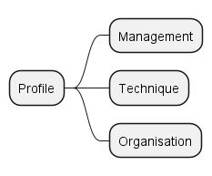
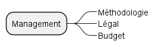
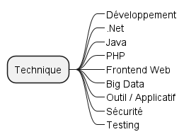
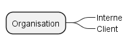

# Organisation des compétences

La roadmap des compétences permet :

- d'avoir un aperçu des compétences
- de choisir une matière dans laquelle évoluer
- d'organiser les ressources documentaires

## Catégories

L'organisation se fait en fonction de catégories articulées sur 3 niveaux hiérarchiques :

- le profile : détermine la facette métier de la compétence,
- le domaine : détermine le champ ou la portée de la compétence,
- les thèmes : déterminent le(s) sujet(s) de la compétence,

## Type de formation

Dans le cadre de l'organisation des ressources documentaires, il existe une catégorie supplémentaire : le type de formation. Celle-ci permet de caractériser ou qualifier le support documentaire (vidéo, syllabus, support formation, etc.).

## Profil

Le profil est le premier niveau hiérarchique. Il détermine la facette métier en rapport avec la compétence.

- **Management** : lié aux métiers de gestion comme peuvent l'être les chefs de projets, chefs d'équipes, scrum master, etc.
- **Technique** : lié aux métiers techniques et aux connaissances des frameworks, applicatifs, outils, etc.
- **Organisation** : cette catégorie existe de manière à pouvoir identifier les compétences liées à l'organisation d'une société, cliente ou pas.

Les profils peuvent être cumulés entre eux.

## Domaine

Le domaine est le deuxième niveau hiérarchique. Il détermine le champ ou la portée de la compétence.

Les diagrammes ci-dessous proposent une découpe des domaines selon le profile. Un domaine est cross-profile, autrement dit un domaine peut se retrouver associé à un profile ou un autre.

Les domaines peuvent être cumulés dans certains cas.

| Management | Technique | Organisation |
|:--:|:--:|:--:|
|  |  |  |

## Thèmes

Les thèmes sont le troisième niveau hiérarchique. Il détermine le sujet de la compétence.

Les thèmes peuvent être associés à différents profils et différents domaines.

Les thèmes ne sont pas définis par une liste exhaustive et peuvent être cumulés.
