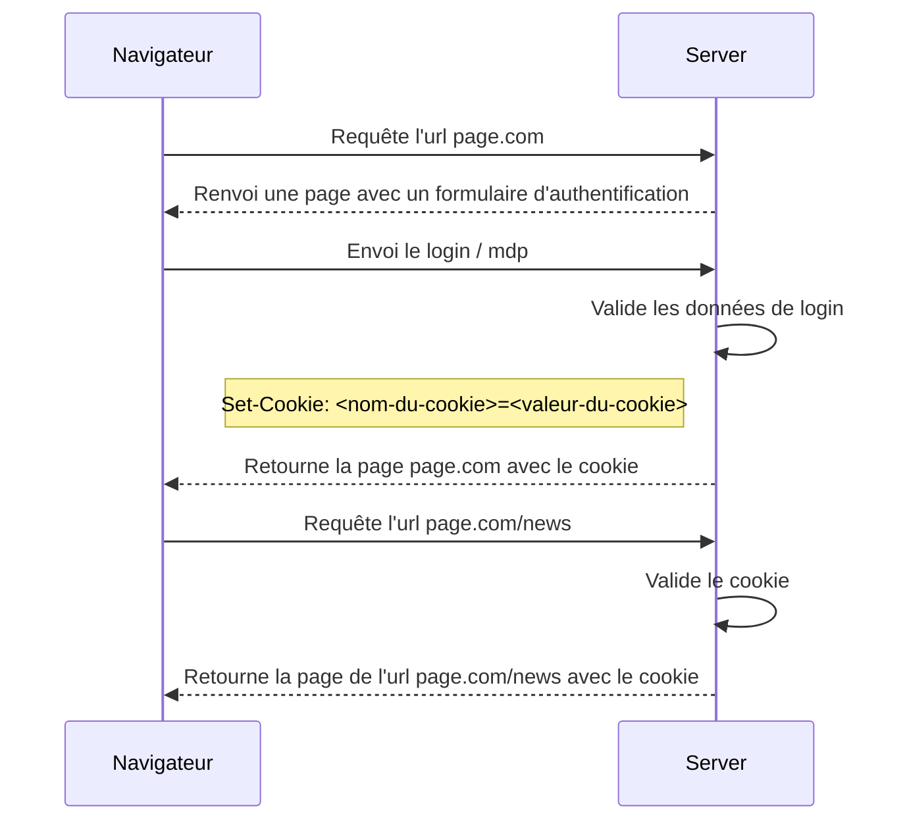

>[!todo]
> - [ ] Description
> 	- [ ] Les propriétés
> 		- [ ] Différence entre `Max-Age` et `Expires`
> 		- [ ] Domain
> 		- [ ] Secure
> 		- [ ] HttpOnly
> 		- [ ] SameSite
> 	- [ ] Cookie de session
> 	- [ ] Cookie permanent
> 	- [ ] Création d'un cookie
> - [ ] Utilisation d'un cookie d'authentification


# Description

Un cookie est un ensemble d'information échangé entre un client et un navigateur. Généralement le cookie est créé par le serveur pour garder des informations d'états, comme par exemple une session, un caddie, des préférences utilisateurs. Dès lors qu'un navigateur reçoit un cookie du serveur, il le stocke localement de manière à pouvoir en extraire les informations et le cas échéant les modifier. Le navigateur, lorsqu'il emet une requête vers le serveur, associe automatiquement le cookie à celle-ci. 

A noter que le client peut lui aussi créer un cookie mais ce point ne sera pas étudier ici.

## Les propriétés 

Les informations d'un cookie sont :

| clé                            | valeur                                                                             |
| ------------------------------ | ---------------------------------------------------------------------------------- |
| `<cookie-name>=<cookie-value>` | La nom et l'informations contenue par le cookie                                    |
| `Expires=<number>`             | Le nombre de secondes après lesquelles le cookie sera supprimé                     |
| `Max-Age=<date>`               | La date d'expiration du cookie après laquelle le cookie doit être supprimé         |
| `Domain=<string>`              | Définie l'*host* vers lequel le cookie sera envoyé.                                |
| `Path=<string>`                | Définie le chemin qui doit être présent dans l'URL.                                |
| `Secure`                       | Permet de spécifier que le cookie ne peut être envoyé qu'avec une requête `https`. |
| `HttpOnly`                     | Permet de déterminer si les données du cookie sont accessible en JavaScript.       |
| `SameSite=<samesite-value>`    | Permet de définir l'autorisation de requêtes `cross-site`.                                                                                   |

Les propriétés vont d'un cookie vont avoir une incidence, en termes de sécurité, 
- sur la longueur (le temps) d'une session d'utilisation, 
- sur la sécurité et l'intégrité des données d'authentifications contenu dans le cookie,
- sur l'URL vers laquelle le navigateur peut envoyer le cookie et par conséquent le serveur qui reçoit les données du cookie,

### `Max-Age` et `Expires`

Les propriétés `Max-Age` et `expires` ont la même conséquence : l'expiration et par conséquent la suppression du cookie. Néanmoins le type de valeur des propriétés est différent.

`Max-Age` contient une valeur de type `number` correspondant au nombre de seconde jusqu'auquelle le cookie expire. Une valeur `0` ou négative signifie que le cookie expire immédiatement.

`Expires` contient une valeur de type `date` correspondant à la date à laquelle le cookie expire et par conséquent est supprimé. S'il n'y a pas de valeur défini, alors le cookie devient un cookie de session.

Si les deux propriétés sont présentes, seule la valeur de `Max-Age` est pris en compte par le navigateur.

### Domain

Cette valeur permet de définir le domaine vers lequel le cookie sera envoyé. Par défaut la valeur est celle du domaine de l'URL courante.

Des domaines multiples, ne sont pas possible, mais dans le cas où un domaine est spécifié **explicitement**  les sous domaines automatiquement sont inclus.

Le cookie sera rejeté par le navigateur si le domaine du serveur qui envoie la réponse avec l'en-tête `Set-Cookie` vers le navigateur, est différent de la valeur contenu dans la propriété domaine du cookie. Par exemple, si le serveur a comme domaine :

```
original-example.com
```

et que l'en-tête a comme valeur :

```
Set-Cookie: plip=plop; domain=other-example.com
```

De même, le cookie sera rejeté si le valeur du domaine est défini pour un sous domaine. Par exemple, si le domaine du serveur est : 

```
foo.com
```

et que l'en-tête a comme valeur :

```
Set-Cookie: plip=plop; domain=sub.foo.com
```

### Secure

Cette valeur permet de s'assurer que les données transmises le seront via le protocol `https` qui garantit l'encryptage des données et une meilleur protection contre les attaques de type *Man in the middle*. 

### HttpOnly

Permet de garantir que le client n'est pas en mesure de lire ou modifier les données contenu dans le cookie via du code JavaScript (`document.cookie`) et par conséquent garantit l'intégrité des données.

A noter que les méthodes JavaScript de requêtes *XHR* associent le cookie à la requête, ce qui atténue les problèmatiques de *cross site scripting* (XSS).

### SameSite

Permet de gérer l'envoie du cookie lors de requêtes `cross-site`, c'est à dire où le domain de destination est différent du domaine d'origine de la requête. Cette propriété apporte une protection contre les *cross-site request forgery attacks* (CSRF). La liste des valeurs est exhaustive. 

`Strict` défini que le cookie n'est envoyé que si l'origine et la destination de la requête ont le même domaine et le même protocol que celui définit dans le cookie. Par conséquent, les requêtes ne seront autorisées que **vers** le **même domaine** du cookie, et **depuis** le **même domaine** du cookie.

`Lax` défini que le cookie n'est pas envoyé lors de requêtes *cross-site*, mais qu'il le sera lors de requête vers le domaine définie dans le cookie et cela même depuis un site externe dont l'origine est différente du domaine du cookie. Par conséquent, les requêtes ne seront autorisées que **vers** le **même domaine** du cookie, mais **depuis n'importe quel domaine**.

`None` défini que le navigateur envoi les cookies que ce soit lors de requêtes *cross-site* ou *same-site*. Par conséquent, les requêtes ne seront autorisées que **vers n'importe quel domaine**, et **depuis n'importe quel domaine**. La propriété `Secure` doit être présente lorsque `None` est utilisé : `SameSite=None; Secure`.

## Cookie de session

Un cookie de session ne contient pas d'information d'expiration. Dès lors, le cookie est supprimé à la fermeture du navigateur.

>[!warning] Restauration
>Certains navigateurs possèdent une fonctionnalité de restauration de session. Dans ce cas, tous les onglets seront restaurés ainsi que les cookies, comme si le navigateur n'avait jamais été fermé.

## Cookie permanent

Un cookie permanent contient une donnée d'expiration qui, sur base de cette date, permet de supprimer le cookie.

## Création d'un cookie

Pour créer un cookie dans le navigateur, le serveur doit ajouter dans l'en-tête de la réponse `Set-Cookie` suivi des données du cookie.

Pour ajouter plusieurs cookie, il faut répéter l'en-tête `Set-Cookie` autant de fois que nécessaire.

```
Set-Cookie: <name>=<value>[; <Max-Age>=<number>] [; Expires=<date>][; Domain=<domain-value>] [; Path=<path-value>][; Secure][; HttpOnly]
```

# Utilisation d'un cookie d'authentification

Les cookies sont essentiellement utilisés dans le cadre de Web App, où toute l'application est stocké sur le serveur. 

Dans ce cas, le serveur génère une page et l'envoie vers le navigateur auquel il associe le cookie. 

Le client va ensuite renvoyer une requête pour l'affichage d'une autre page auquel il associe le cookie reçu. 

Finalement, le serveur reçoit le requête, valide le cookie associé, génère la nouvelle page et la renvoie vers le navigateur. Si le cookie reçu par le serveur est expiré ou corrompu, le serveur le génère une la page d'authentification et la renvoi vers le navigateur.



---
Voir aussi : [[Cookies vs. token]]