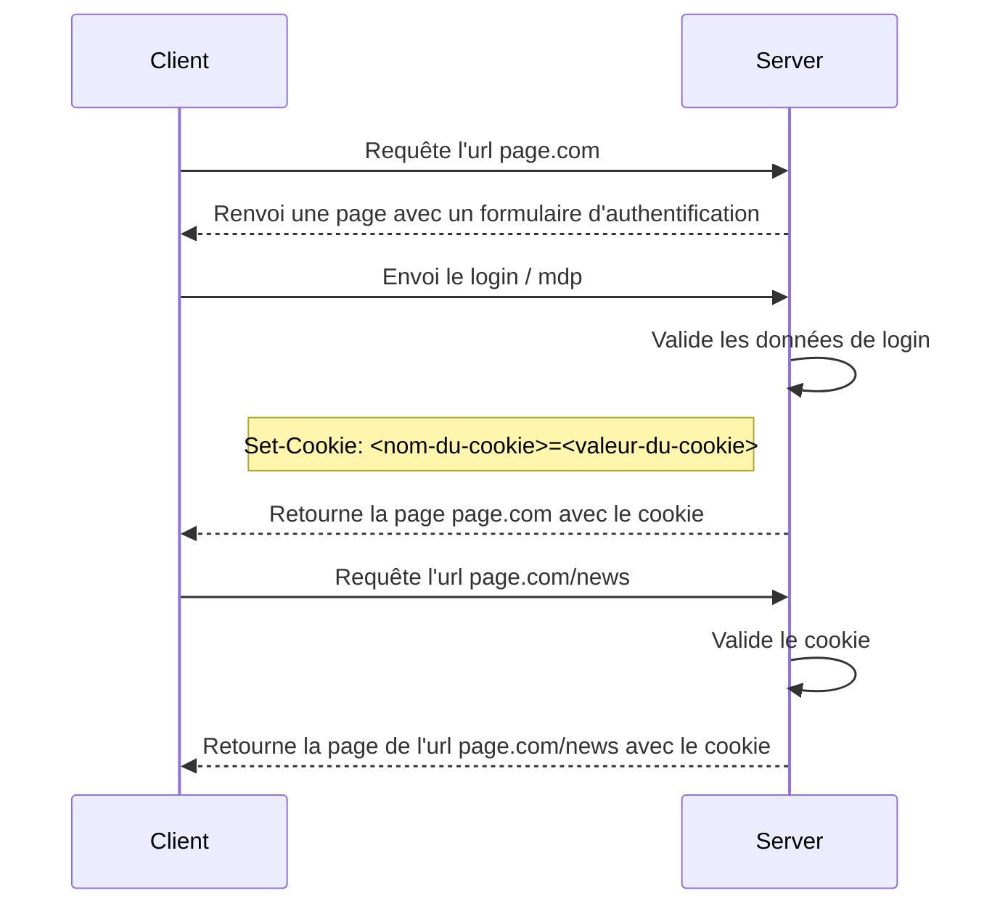

>[!todo]
> - [x] Description
> - [ ] Les propriétés
> - [ ] Utilisation d'un cookie
> 	- [ ] Limite du cookie (vs. token)

# Description

Un cookie est un ensemble d'information échangé entre un client et un navigateur. Généralement le cookie est créé par le serveur pour garder des informations d'états, comme par exemple une session, un caddie, des préférences utilisateurs. Dès lors qu'un navigateur reçoit un cookie du serveur, il le stocke localement de manière à pouvoir en extraire les informations et le cas échéant les modifier. Le navigateur, lorsqu'il emet une requête vers le serveur, associe automatiquement le cookie à celle-ci. 

A noter que le client peut lui aussi créer un cookie mais ce point ne sera pas pris étudier dans ce chapitre.

## Les propriétés 

Les propriétés d'un cookie sont 
- La clé qui correspond au nom du cookie
- La valeur qui correspond aux informations contenue par le cookie
- La date d'expiration du cookie, autrement dit à quelle date le cookie est-il considéré comme invalide.
- Le flag `HttpOnly` qui permet de déterminer si le navigateur peut avoir accès ou pas au cookie.

```

```

### HttpOnly

De manière à ne pas exploiter les données du cookie du navigateur et de ne pas pouvoir les corrompre, le cookie est :
- Crypté
- Inex

## Utilisation d'un cookie

Les cookies sont essentiellement utilisés dans le cadre de Web App, où toute l'application est stocké sur le serveur. Dans ce cas, le serveur génère une page et l'envoie vers le client auquel il associe le cookie. Le client va ensuite renvoyer une requête pour l'affichage d'une autre page auquel il associe le cookie reçu. Finalement, le serveur recoit le requête, valide le cookie associé, génère la nouvelle page et la renvoie vers le navigateur. Si le cookie reçu par le serveur est expiré ou corrompu, le serveur génère une page d'authentification et le renvoie vers le navigateur.



### Les contraintes d'un cookie