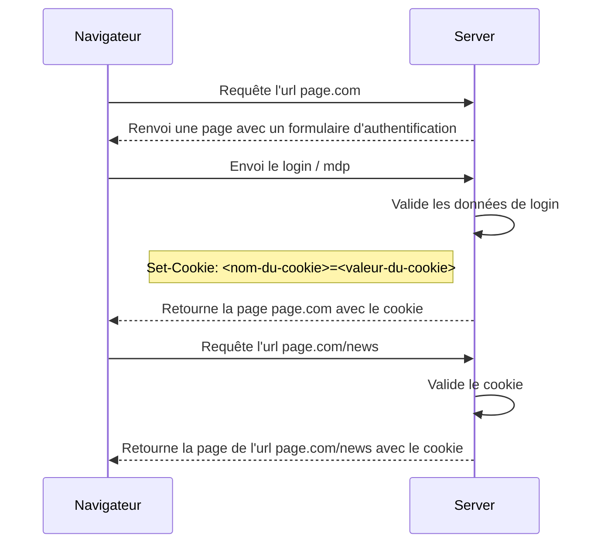

# Utilisation d'un cookie d'authentification

Les cookies sont essentiellement utilisés dans le cadre de Web App, où toute l'application est stocké sur le serveur. 

Dans ce cas, le serveur génère une page et l'envoie vers le navigateur auquel il associe le cookie. 

Le client va ensuite renvoyer une requête pour l'affichage d'une autre page auquel il associe le cookie reçu. 

Finalement, le serveur reçoit le requête, valide le cookie associé, génère la nouvelle page et la renvoie vers le navigateur. Si le cookie reçu par le serveur est expiré ou corrompu, le serveur le génère une la page d'authentification et la renvoi vers le navigateur.

## Ajouter une des données de session