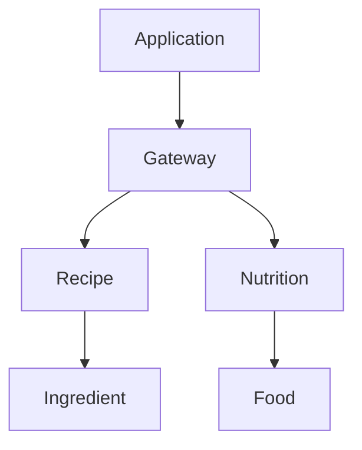

# GraphQL - Schema Stitching Vs. Federation

Dans l'univers de GraphQL, on peut entendre résonner deux concepts qui ont la même finalité : le schema stitching et schema federation.

## Le principe de base

Ce que l'on veut c'est pouvoir récupérer des modèles de données de plusieurs services différents qui se référencent entre eux et n'en faire qu'un.

Par exemple, dans le cas d'une application mobile de gestion de menu (recettes), on a deux services :

- Le `Nutrition` service qui s'occupe de gérer les aliments : leurs noms, leurs propriétés nutritionnelles, etc.  
- Le `Recipe` service qui s'occupe de gérer les recettes, c'est-à-dire de lister les ingrédients et les actions pour réaliser la recette.

Le service `Recipe` est capable donc de lister les ingrédients d'une recette. Le modèle de données d'un ingrédient référence l'aliment et offre d'autres informations comme la quantité.

Les aliments sont eux gérés par le service `Nutrition`.

Conclusion, pour récupérer la liste des ingrédients d'une recette avec le nom de l'aliment et la quantité nécessaire, il faut faire appel à la fois au service `Nutrition` et `Recipe`. Pour ce faire, il faut réaliser une API Gateway qui aura la responsabilité de rassembler les données et d'exposer un modèle de données étendu, composé des données des aliments et des recettes.

## Les solutions

Pour ce faire, nous avons le choix entre deux méthodes :  
- Le schema stitching  
- Le schema federation

### Federation

Le principe de fédération est de considéré que chaque service est responsable de définir son modèle dans sa globalité. Autrement dit, les services définissent leurs propres modèles liés à leurs propres entités, mais également les propriétés dépendantes d'autres services.

Dans notre cas, c'est le service `Recipe` qui a la responsabilité de définir les propriétés des autres modèles des autres services dont il a besoin, en l'occurrence, le nom de l'aliment géré par le service `Nutrition`.

Finalement, c'est sur base de cette définition que l'API Gateway sera en mesure de faire les requêtes aux différents services nécessaires, sur base de la query envoyé.

### Stitching

Dans le cas du schema stitching, la responsabilité d'étendre le modèle revient à l'API Gateway seule.

Par conséquent, dans le cas de notre exemple. L'API Gateway va récupérer les modèles des services dépendants et sur base de ceux-ci, il va les étendre et implémenter les méthodes de récupération des données dépendantes.

## Les contraintes

En terme intuitif, on pourrait se laisser penser que la méthode de fédération est meilleure, car en tant que développeur, on peut facilement se rendre compte au moment de l'élaboration du modèle, toutes les données qui se rapportent à ce modèle. Néanmoins, cette méthode est sujette à une contrainte très forte : le développeur doit être en mesure d'adapter tous les services dont il dépend. Par conséquent, si le service est une dépendance tierce d'un autre éditeur, le développeur ne peut généralement pas avoir accès aux sources et faire les modifications dont il a besoin.

Contrairement au schema stitching qui lui va permettre l'intégration de services dont on n’a pas la responsabilité (d'implémentation) et l'étendre avec des données d'autres services.

En outre, attention que ce choix n'est possible qu'en fonction des fonctionnalités livrées par la librairie utilisée. En effet, certaines librairies n'implémentent pas les fonctionnalités et ne permettent donc pas de les utiliser. Par exemple, la librairie `graphql-dotnet` n'implémente pas de fonctionnalité de schéma stitching.

## Exemple

Consulter le [POC](https://github.com/diplomegalo/Poc/tree/master/Poc.GraphQL.Gtw) de création d'une API Gateway avec le schema stitching et la librarie HotChocolate.