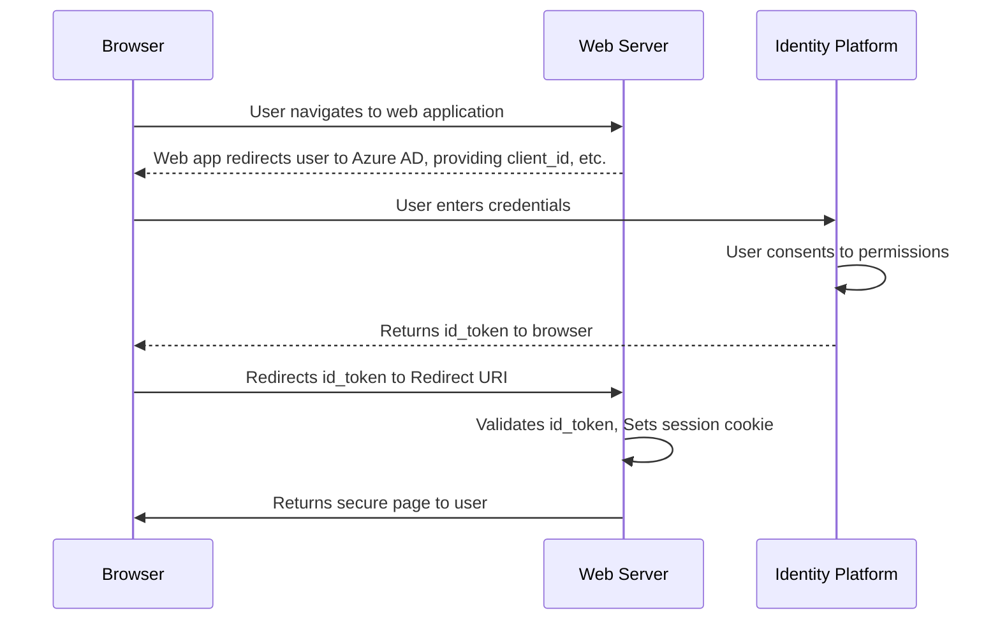

# Sign-in

# Enable ID tokens

ID tokens aren't issued by default for an application registered with the Microsoft identity platform. See methods to [enable ID tokens](https://learn.microsoft.com/en-us/azure/active-directory/develop/v2-protocols-oidc#enable-id-tokens).

# Fetch the OpenID configuration document

Microsoft identity platform provide an [OpenID Provider Configuration Document](https://openid.net/specs/openid-connect-discovery-1_0.html). Libraries are the most common consumers of the OpenID configuration document, which they use for discovery of authentication URLs, the provider's public signing keys, and other service metadata.

## Find your app's OpenID configuration document URI

To determine the URI of the configuration document's endpoint for your app, append the _well-known OpenID configuration_ path to your app registration's _authority URL_.
- **Well-known configuration document path**: `/.well-known/openid-configuration`
- **Authority URL**: `https://login.microsoftonline.com/{tenant}/v2.0`

| **Value**                                                               | **Description**                                                                                                                                                                        |
| ------------------------------------------------------------------- | ---------------------------------------------------------------------------------------------------------------------------------------------------------------------------------- |
| `common`                                                            | Users with both a personal Microsoft account and a work or school account from Azure AD can sign in to the application                                                             |
| `organizations`                                                     | Only users with work or school accounts from Azure AD can sign in to the application.                                                                                              |
| `consumers`                                                         | Only users with a personal Microsoft account can sign in to the application                                                                                                        |
| `8eaef023-2b34-4da1-9baa-8bc8c9d6a490` or `contoso.onmicrosoft.com` | Only users from a specific Azure AD tenant (directory members with a work or school account or directory guests with a personal Microsoft account) can sign in to the application. |

# Send the sign-in request

1. Authenticate a user and request an ID token by redirect to the Microsoft identity platform's _/authorize_ endpoint (see an example of the [sign-in request](https://learn.microsoft.com/en-us/azure/active-directory/develop/v2-protocols-oidc#send-the-sign-in-request)).
2. Prompt user to enter their credentials and complete the authentication and the consents to the required permissions if needed (the first time).
3. Return a response to your app at the indicated redirect URI by using the method specified in the `response_mode` parameter.

# Validate the ID token

Receiving an ID token in your app might not always be sufficient to fully authenticate the user. You might also need to validate the ID token's signature and verify its claims per your app's requirements. If you validate ID tokens in your application, we recommend _not_ doing so manually. Instead, use a token validation library to parse and validate tokens. Token validation libraries are available for most development languages, frameworks, and platforms.

---
tags: #identity  
refs:
- https://learn.microsoft.com/en-us/azure/active-directory/develop/v2-protocols-oidc
- [Final: OpenID Connect Discovery 1.0 incorporating errata set 1](https://openid.net/specs/openid-connect-discovery-1_0.html)
